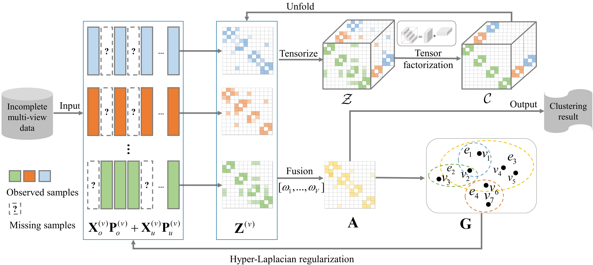

# 
`High-order Correlation Preserved Incomplete Multi-view Subspace Clustering (IEEE TIP 2022)`

> **Authors:**
Zhenglai Li, Chang Tang, Xiao Zheng, Xinwang Liu, Wei Zhang, En Zhu

This repository contains simple Matlab implementation of our paper [HCP-IMSC](https://ieeexplore.ieee.org/abstract/document/9718038).

### 1. Overview

      

Framework of the proposed HCP-IMSC method. Multi-view affinity matrices $\{\mathbf{Z}^{(v)}\}_{v=1}^V$ are generated from multi-view data $\{\mathbf{X}_o^{(v)}\mathbf{P}_o^{(v)} + \mathbf{X}_u^{(v)}\mathbf{P}_u^{(v)}\}_{v=1}^V$. To effectively capture the subspace structure, the tensor factorization is employed to learn a low rank tensor representation $\mathcal{C}$ from $\mathcal{Z}$ which is constructed by stacking multi-view affinity matrices into a third-order tensor. A unified affinity matrix $\mathbf{A}$ is obtained by fusing view-specific ones with diverse view weights $[\omega_1, ..., \omega_V]$ in a self-weighted manner. To effectively recover the samples with missing views, a hypergraph $\mathbf{G}$ induced hyper-Laplacian regularization is introduced to restrict the samples with missing views to be reconstructed by their neighbor ones. Furthermore, the affinity matrices learning, tensor factorization, and missing view inferring are integrated into a unified optimization framework.  

### 2. Usage
+ Prepare the data:
    - The natural imcomplete datas, including 3sources, bbc, bbcsport can be obtained in `.\Exp\Incomplete\`.
    - To generate the incomplete views, we first randomly select $n_p$ samples and set them as paired ones which are observed in all views. For the rest $n-n_p$ samples, a random matrix $\mathbf{M} = [\mathbf{m}_1, \mathbf{m}_2,..., \mathbf{m}_(n-n_p)] \in \{0,1\}^{(n-n_p)\times V}, 0<\sum_{v=1}^V \mathbf{m}_{iv} <V$ is generated. Then $m_{iv} = 1$, $m_{jw} = 0$ are used to indicate that the $i$-th sample is observed in $v$-th view and $j$-th sample is missing in $w$-th view, respectively. The code can be found in `.\Exp\Incomplete\randomly_generate_partial_data.m`.

+ Prerequisites for Matlab:
    - Downloade graph signal processing toolbox [GSPBox](https://github.com/epfl-lts2/gspbox)
    - Test on Matlab R2018a `Run demo.m`

+ Conduct clustering

+ Comparison
    - We also provide code for easily performing clustering results comparison. 
        * '.\Exp\plot_clustering_results_measured_by_acc.m'
        * '.\Exp\report_clustering_results_measured_by_seven_metrics_on_3sources_bbc_bbcsport.m'
        * '.\Exp\report_clustering_results_measured_by_seven_metrics_on_ORL.m'

### 3. Citation

Please cite our paper if you find the work useful:

    @article{Li_2022_HCP_IMSC,
        author={Li, Zhenglai and Tang, Chang and Zheng, Xiao and Liu, Xinwang and Zhang, Wei and Zhu, En},
        journal={IEEE Transactions on Image Processing}, 
        title={High-Order Correlation Preserved Incomplete Multi-View Subspace Clustering}, 
        year={2022},
        volume={31},
        number={},
        pages={2067-2080},
        doi={10.1109/TIP.2022.3147046}
        }